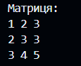

# Опис завдання

## Знайти число, яке повторюється найбільшу кількість разів в матриці

У цьому завданні ми маємо матрицю розміром N x M і маємо знайти число, яке повторюється найбільшу кількість разів.

### Приклад

Матриця:

У цьому прикладі число 3 повторюється найбільшу кількість разів (три рази), тому воно і буде результатом.

## Опис розв'язку

Для розв'язання цього завдання ми використовуємо клас MatrixAnalyzer, який містить статичний метод findMostFrequentNumber. Цей метод приймає матрицю цілих чисел та повертає число, яке повторюється найбільшу кількість разів. Він використовує клас Arrays для плоского вирівнювання матриці та підрахунку кількості входжень кожного числа.

## Тестування

Використовується клас MatrixAnalyzerTest для тестування методу findMostFrequentNumber класу MatrixAnalyzer. У цьому класі тестуються різні вхідні дані для перевірки коректності роботи методу.
